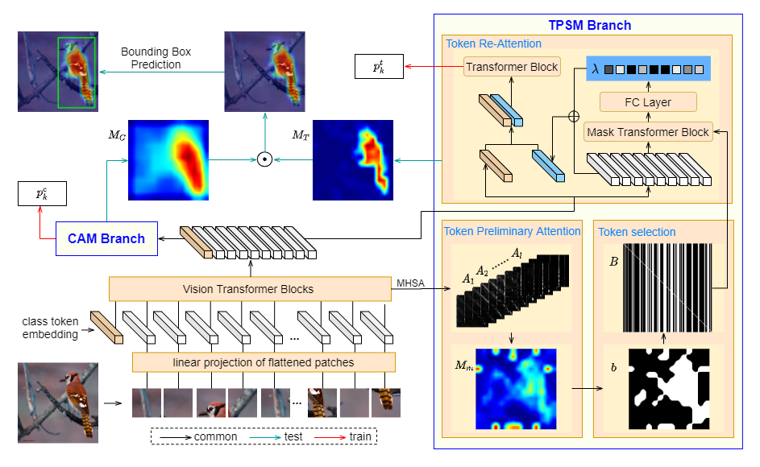
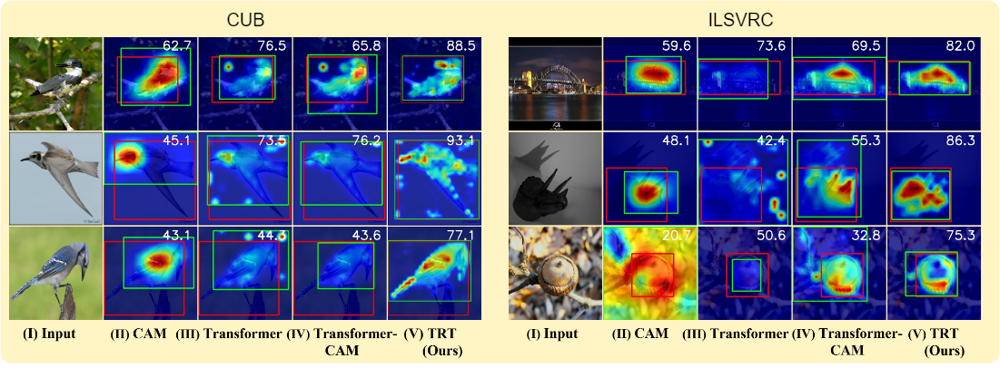

# Re-Attention Transformer for Weakly Supervised Object Localization
This is the official implementaion of paper [***Re-Attention Transformer for Weakly Supervised Object Localization***]

This repository contains Pytorch training code, evaluation code, visualization code and pretrained models.

## Illustration
Based on Deit, we propose an re-attention strategy based on token refinement transformer
(TRT) to grasp objects of interest more precisely. TRT suppresses the effects of background noise
in transformer and focuses on the target object, achieving remarkable performance in WSOL.




## Updates
- 

## Model Zoo

We provide pretrained TRT models trained on CUB-200-2011 and ImageNet_ILSVRC2012 datasets.

All our trained TRT weights are provided here:  
link:    https://pan.baidu.com/s/1VKa6lAam-JHPiuLoIHwfAw 
code：  0311 

#### CUB-200-2011 dataset

| Backbone | Loc.Acc@1 | Loc.Acc@5 | Loc.Gt-Known | MaxBoxAccV2 | Baidu Drive | Code |
| --- | --- | --- | --- | --- | --- | --- |
|  Deit-TRT   |   76.5   |   88.0  |  91.1  |   82.08  |  [model](https://pan.baidu.com/s/1eHcU3UnGW8k7lyCcHMWwSg)  | 0311  |
|  Deit-TRT-384   |   80.5   |  91.7   |  94.1  |  87.04  |   [model](https://pan.baidu.com/s/1TnKfXrD_f-IAMGfxGUDARA)  | 0311  |


#### ILSVRC2012 dataset

| Backbone | Loc.Acc@1 | Loc.Acc@5 | Loc.Gt-Known | MaxBoxAccV2 | Baidu Drive | Code |
| --- | --- | --- | --- | --- | --- | --- |
|  Deit-TRT   |   58.8   |  68.3   |  70.7  |  67.35   |   [model](https://pan.baidu.com/s/19QfTJE0w2zjdYXc7718JHg)  | 0311  |


## Usage

First clone the repository locally:
```
git clone https://github.com/su-hui-zz/ReAttentionTransformer.git
```
Then install Pytorch 1.10.2 , torchvision 0.11.3+.
pip install timm==0.5.4

### Data preparation

#### CUB-200-2011 dataset

Please download and extrate [CUB-200-2011](http://www.vision.caltech.edu/visipedia/CUB-200-2011.html) dataset. 

The directory structure is the following:

```
  ./data/
    CUB-200-2011/
      attributes/
      images/
      parts/
      bounding_boxes.txt
      classes.txt
      image_class_labels.txt
      images.txt
      image_sizes.txt
      README
      train_test_split.txt
```

#### ImageNet1k

Download [ILSVRC2012](http://image-net.org/) dataset and  extract train and val images.

The directory structure is organized as follows: 

```
  ./data/
  ImageNet_ILSVRC2012/
    ILSVRC2012_list/
    train/
      n01440764/
        n01440764_18.JPEG
        ...
      n01514859/
        n01514859_1.JPEG
        ...
    val/
      n01440764/
        ILSVRC2012_val_00000293.JPEG
        ...
      n01531178/
        ILSVRC2012_val_00000570.JPEG
        ...
    ILSVRC2012_list/
      train.txt
      val_folder.txt
      val_folder_new.txt
```

And the training and validation data is expected to be in the `train/` folder and `val` folder respectively:

### For training: training examples are in train_cub.sh and train_ilsvrc.sh.
The basic backbone used is the Deit-Base pretrained on ImageNet-1K. We train the backbone and TPSM branches with ./tools_cam/train_cam.py first, then we fix backbone and TPSM branch parameters and train the CAM branch with ./tools_cam/train_cam_fusecamfz.py. 

Before training, we should ```mkdir pretraineds``` and ```wget  https://dl.fbaipublicfiles.com/deit/deit_base_patch16_224-b5f2ef4d.pth ``` in pretraineds folder. 

On CUB-200-2011 dataset:
```
python ./tools_cam/train_cam.py --config_file ./configs/CUB/deit_trt_base_patch16_224_0.6.yaml --lr 5e-5 MODEL.CAM_THR 0.1
```
```
python ./tools_cam/train_cam_fusecamfz.py --config_file ./configs/CUB/deit_trt_fuse_base_patch16_224_0.6.yaml --lr 5e-5 MODEL.CAM_THR 0.1 MODEL.POSWEIGHTS ./ckpt/CUB/deit_trt_base_patch16_224_TOKENTHR0.6_BS128/ckpt/model_best_top1_loc.pth
```


On ImageNet1k dataset:
```
python ./tools_cam/train_cam.py --config_file ./configs/ILSVRC/deit_trt_base_patch16_224_0.95.yaml --lr 5e-4 MODEL.CAM_THR 0.12
```
```
python ./tools_cam/train_cam_fusecamfz.py --config_file ./configs/ILSVRC/deit_trt_fuse_base_patch16_224_0.95.yaml --lr 5e-4 MODEL.CAM_THR 0.12 MODEL.POSWEIGHTS ./ckpt/ImageNet/deit_trt_base_patch16_224_0.95_0.688/ckpt/model_best_top1_loc.pth

```
Please note that pretrained model weights of Deit-tiny, Deit-small and Deit-base on ImageNet-1k model will be downloaded when you first train you model, so the Internet should be connected. 

### For evaluation:  evaluating examples are in val_cub.sh and val_ilsvrc.sh
On CUB-200-2011 dataset:
```
python ./tools_cam/test_cam.py --config_file configs/CUB/deit_trt_fuse_base_patch16_224_0.6.yaml --resume ./ckpt_save/CUB/deit_trt_fuse_base_patch16_224_TOKENTHR0.6_BS128_0.912/ckpt/model_best_top1_loc.pth MODEL.CAM_THR 0.1 TEST.METRICS gt_top  #(TEST.METRICS maxboxaccv2)
```
On ImageNet1k dataset:
```
python ./tools_cam/test_cam.py --config_file configs/ILSVRC/deit_trt_fuse_base_patch16_224_0.95.yaml --resume ./ckpt_save/ImageNet/deit_trt_fuse_base_patch16_224_0.707/ckpt/model_best_top1_loc.pth MODEL.CAM_THR 0.12 TEST.METRICS gt_top
```

`TEST.METRICS` should be metrics for testing, you can choose `gt_top` for gt-known accuracy and top1/5 accuracy, or `maxboxaccv2` for MaxBoxAccv2.
`TEST.SAVE_BOXED_IMAGE` should be chosen `True` if you want to save all test images with bounding boxes. 


### Visualization
We provided `visualize.py` in `tools_cam` folder.
```
python ./tools_cam/visualize.py --config_file config_file_pth --pth_file trained_weights_pth_file
```

## Performance

We provide some visualization results as follows to show our superiority.



## Contacts

If you have any question about our work or this repository, please don't hesitate to contact us by emails.
- [suhui@zhejianglab.com]
- [chenglc@zhejianglab.com]

You can also open an issue under this project.

## Citation
If you use this code for a paper please cite:

```
@article{su2022re,
  title={Re-Attention Transformer for Weakly Supervised Object Localization},
  author={Su, Hui and Ye, Yue and Chen, Zhiwei and Song, Mingli and Cheng, Lechao},
  journal={arXiv preprint arXiv:2208.01838},
  year={2022}
}
```

## Acknowledgment

Our project references the codes of  [vasgaowei/TS-CAM: Codes for TS-CAM: Token Semantic Coupled Attention Map for Weakly Supervised Object Localization. (github.com)](https://github.com/vasgaowei/TS-CAM) . Thanks for their works and sharing.

